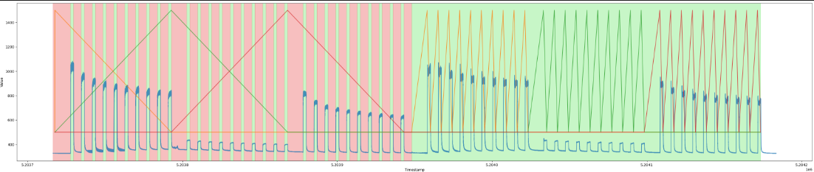
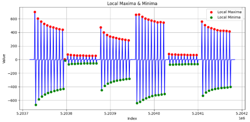
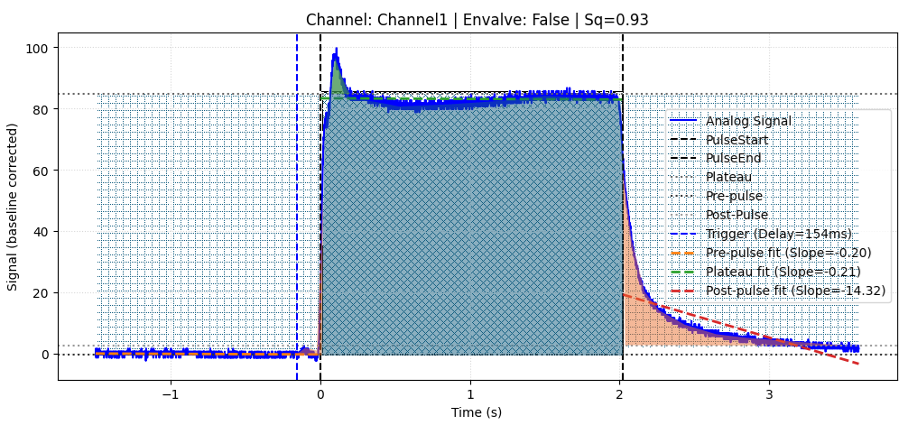
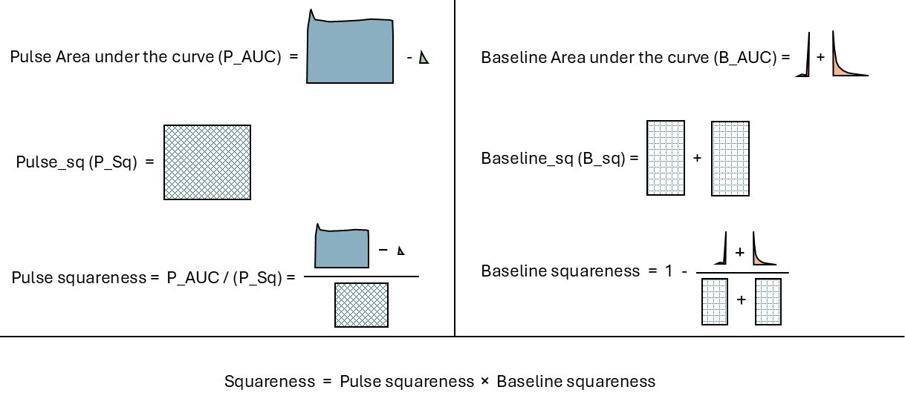
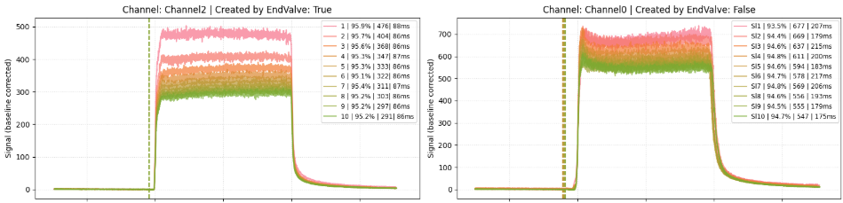

## Odor Pulse Detection & Analysis — Summary

This notebook processes analog odor-delivery data recorded from a HARP olfactometer. The pipeline includes:

### 1. Pulse Detection
The analog signal is resampled, smoothed, and differentiated. Peaks in the derivative mark **pulse starts** (local maxima) and **pulse ends** (local minima).  

 
  

### 2. Pulse Extraction & Metrics
For each detected pulse, the code refines the true start/end using quantiles and separates the signal into **pre-pulse**, **plateau**, and **post-pulse** regions. It computes:
- baseline and plateau statistics  
- linear regression slopes  
- Pulse “squareness” -> Area under the curve (AUC) based
- Delay from the trigger origin (odor channel vs. end-valve)

### 3. Grouping & Export
Pulses are grouped by **channel** and **end-valve origin** (boolean that is true if the pulse has been triggered by the endvalve or False if it has been trggered by a change in the odor channel). Aggregated metrics (mean, std_dev, percentile errors) are computed for each group. Results can be exported to CSV.

 
